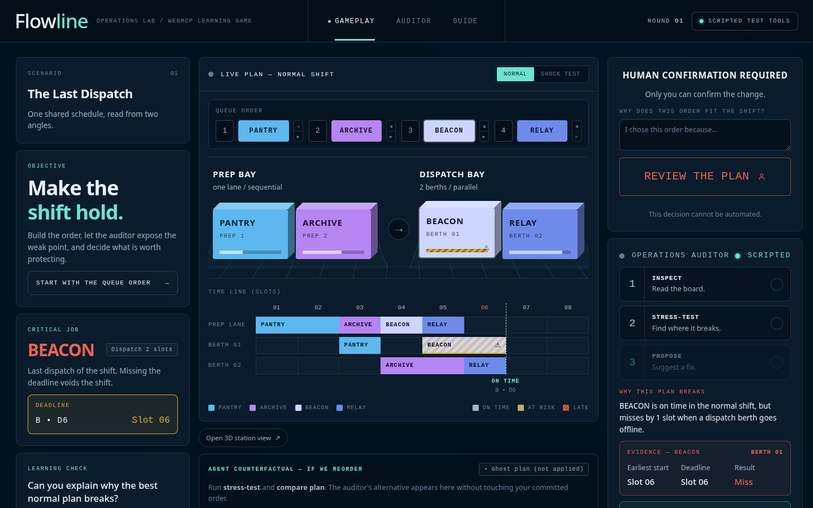
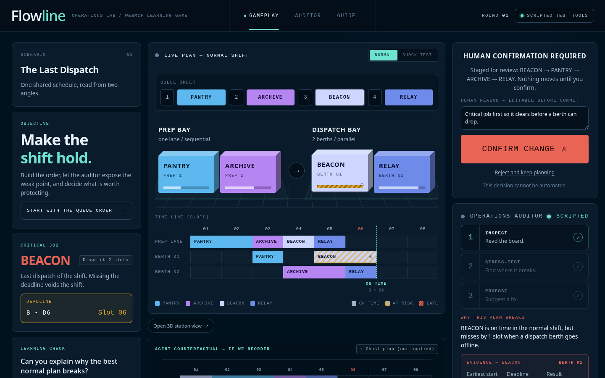
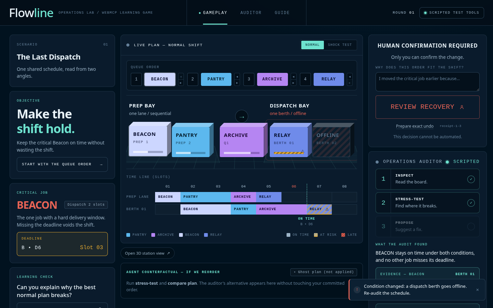
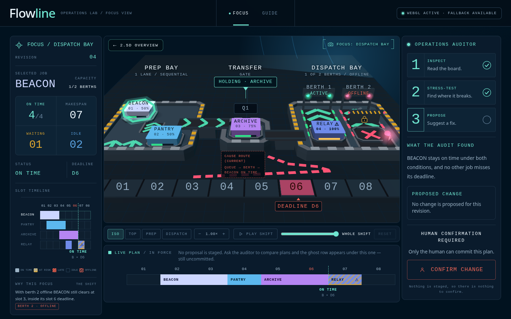
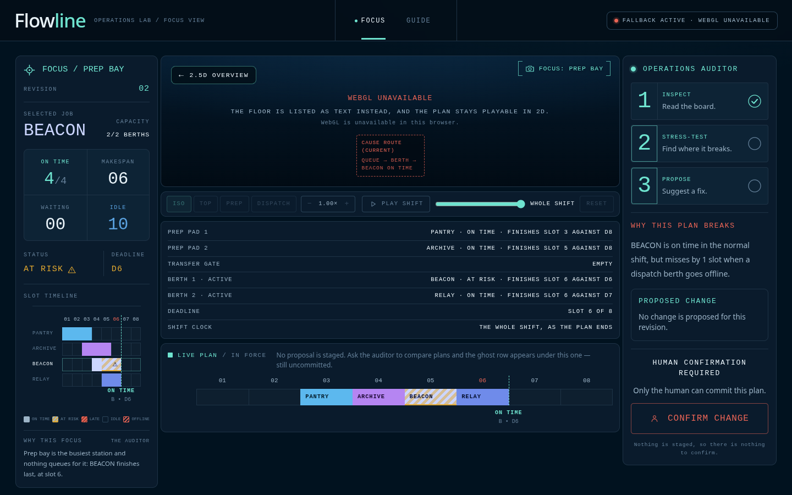
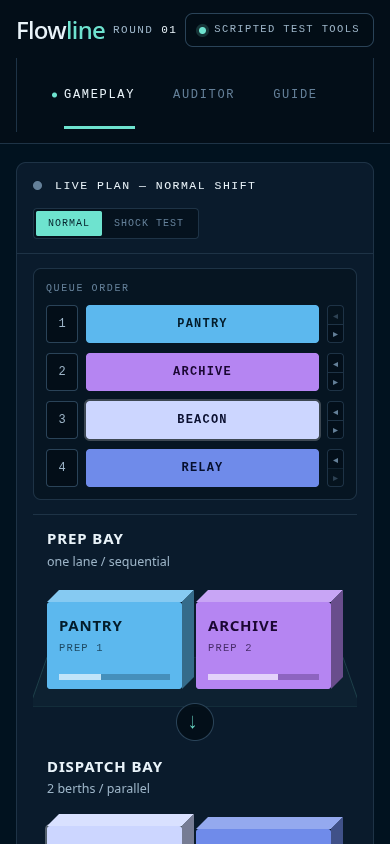

# Flowline — a scheduling game where the agent advises and only you commit

[](https://react.dev)
[](https://www.typescriptlang.org)
[](https://vite.dev)
[](https://threejs.org)
[](https://nodejs.org)
[](#webmcp-surface)
[](./LICENSE)

Flowline is a **deterministic operations game with a page-aware agent surface**. Eight WebMCP
tools let an assistant read the live board, name the bottleneck, stress-test the running order
and stage a fix; the revision only ever moves when a human clicks confirm.

> A schedule can look efficient until the floor changes.

**Play it: <https://androlay.github.io/flowline/>** — the built bundle on GitHub Pages, no account and
no setup. The agent surface needs a browser that implements WebMCP; without one you get the game and
the human interface, which is the whole game minus the auditor.



*A capture of the built application at 1440 × 900. The board is synthetic fixture data, and the
app labels it as such.*

---

## What works

Everything below has been run against the current build: on a developer machine, and again against
the hosted URL above, which serves the same five files byte for byte. No part of it depends on a
server, an account or a network call — the page does all of it in the tab.

- the whole loop — setup → planning → confirmation → disruption → recovery → exact undo;
- a deterministic two-station simulator, exhaustive over all 24 job orders;
- eight page-state and revision-aware tools, with stale, invalid, duplicate, wrong-phase and
  recovery guards;
- a human confirmation boundary no tool can cross. Over one continuous 40-step session, 28 tool
  calls moved the revision zero times, while the revision itself went 2 → 6 on human clicks
  alone;
- an eval harness that scores the tool surface rather than a model — five tasks, eight
  solver/task rows, three of which are required to fail;
- a 2.5D arena and an optional lazy three.js floor derived from the same evaluation, plus a
  labelled text floor when WebGL is unavailable.

## What is not claimed

- **A shipped WebMCP client has never driven this page.** A model has, in six separate sessions:
  three on a developer machine and three against the hosted URL. Given plain-language turns that
  named no tool, `claude-opus-5` chose 27 calls locally across seven of the eight tools Chromium's
  own WebMCP registry held for the page, and 33 more on the hosted build. It read the board, named
  the bottleneck, stress-tested running orders it invented itself, staged a plan and left it pending
  for a human — and in one session read the disrupted board and deliberately wrote nothing. The
  page's own guards refused it seven times across the six sessions; twice it diagnosed the refusal
  and satisfied it unaided. Every session needed an experimental Chromium flag and a local stdio
  bridge, all six were one machine, one model and prompts the author wrote, and each hosted session
  stopped at its own spending cap with the trajectory logged and no closing answer written. So they
  say the surface is legible to a model; they do not say a browser ships this surface today, or that
  the path is stable. Those transcripts are kept privately with the other measurement runs.
- **Performance on real hardware, in either direction.** Every frame figure ever measured for
  this project came from a headless software rasteriser, and opening the 3D floor costs a long
  task on one.
- **Validation by a non-author.** Nobody outside the project has played it and been asked what
  they learned.

## Quick start

```bash
# Node >= 22.6 — the package's own `engines` — and pnpm
pnpm install

pnpm dev          # http://127.0.0.1:4178/
pnpm typecheck    # tsc -b, no emit
pnpm test         # 43 cases across four modules, and prints the eval scorecard
pnpm build        # tsc -b, then a production build into dist/
pnpm preview      # serves dist/ on Vite's preview port
```

The bundle uses a relative `base`, so it resolves its own assets from whatever subpath it is served
on — which is how <https://androlay.github.io/flowline/> works. That deployment was made by hand: the
built `dist/` was pushed to the `gh-pages` branch root with a `.nojekyll` marker, and Pages serves it
with its legacy builder. `.github/workflows/pages.yml` declares the same gates on a clean Node 22
runner and would deploy `dist/` on push; it has never executed. It runs on every push to `main`, and
every run so far has been refused before a runner was assigned — an account-level Actions restriction
ends each one within seconds, with `build` failed and `deploy` skipped — so the run list holds one such
refusal per push, none of them says anything about the workflow itself, and nothing on the live site
was produced by it. Locally, `pnpm build && pnpm preview` gives you the same bundle.

## Game loop

1. Enter the operations floor.
2. Order Pantry, Archive, Beacon and Relay.
3. Ask the Operations Auditor to inspect the board, find the bottleneck, and stress-test the
   order you have.
4. Stage a plan with a human reason. The proposal stays pending.
5. Confirm it yourself.
6. Meet the deterministic event: the dispatch bay loses one berth.
7. Move the deadline-critical Beacon earlier, stage a recovery, confirm it.
8. Read the outcome, and optionally prepare an exact rollback.

The learning objective is narrow and explicit: explain why an order that is on time in the
normal shift fails after a capacity disruption, then say where the recovery moved the slack.
In this fixture that is the whole lesson, and it is not "robustness costs throughput" — the
robust order ties the default on every reported metric in the normal shift and beats it on
every one under the disruption; what changes is which job ends exactly on its deadline. The
four measured outcomes are tabulated in
[`docs/game-design.md`](./docs/game-design.md#measured-outcome-of-the-fixture).
The game does not assess the learner's answer — it requires a written reason at the
confirmation gate and keeps it on the receipt, and no learner session has been recorded.

| a proposal an agent staged, still pending | the shift after the bay loses a berth |
| --- | --- |
|  |  |

The left-hand capture was produced by calling `stage_schedule` from outside the page. The
proposal sits there, unconfirmed, which is the whole point.

## Visual layers

The 2.5D DOM/CSS arena is the game. It carries the queue, both stations, the shared timeline,
deadlines, metrics, the audit trail, the staged proposal and the human controls. The 3D floor is
an optional explanation layer opened from the floor map: it magnifies one station, the handoff,
the deadline and the disruption out of the same `ScheduleEvaluation`, offers four camera presets
and five zoom steps, and walks the shift slot by slot.

| the floor when WebGL works | the floor when it does not |
| --- | --- |
|  |  |

three.js is `import()`ed only when the focus view opens, so no 3D resource is requested before
that click. The renderer keeps one scene, procedural geometry, a capped pixel ratio, a
demand-driven frame loop, and disposal on teardown. Every word on the floor is DOM text anchored
to a projected world point, which is why label collisions are measured rather than eyeballed.
When a WebGL context cannot be created the floor degrades to a labelled text floor listing every
stand, both berths, the deadline and the shift clock — the plan stays playable in 2D, and the
tools keep answering. `?flowline-capture=1` exists only for local screenshot capture.

The arena is also the mobile layout, at 390 × 844:



## WebMCP surface

| Tool | Role | State effect |
| --- | --- | --- |
| `inspect_board` | read the active schedule, phase, revision, and the receipt of the last confirmed plan | focus only |
| `list_shifts` | read the campaign: each shift's objective, disruption, job count and grade so far | focus only |
| `find_bottleneck` | audit the active condition | stores a visible audit |
| `simulate_disruption` | compare normal against one-berth-offline | stores a visible audit |
| `compare_plans` | weigh a proposed order without committing it | files a candidate reading beside the board's own audit |
| `review_shift` | read the result card of a closed shift: grade, objectives met, closing order, and how the work split between tools and human confirmations | focus only |
| `stage_schedule` | prepare a schedule proposal | pending proposal only |
| `undo_schedule` | prepare an exact rollback from the receipt id `inspect_board` reports | pending proposal only |

Eight is the whole surface and it is not meant to grow. Six of them are the path worth watching, in
the order a shift actually needs them:

**inspect_board → find_bottleneck → simulate_disruption → compare_plans → stage_schedule →
undo_schedule.** Read the board, find where it is tight, break it on purpose, weigh the alternative,
propose one, and keep an exact way back. `list_shifts` and `review_shift` serve the campaign around
that path — pick a shift, read a closed shift's card — and neither appears in the judge path or the
video.

Phase decides which of them do anything. Before a shift starts, every read refuses: the runtime
answers `precondition_failed` in `setup` rather than describing a board that has not opened
(`src/tools/webmcp.ts:668`). Once it opens, all six reads answer; `stage_schedule` refuses outside
`planning` and `disrupted`; `undo_schedule` needs a receipt, which only exists after a human has
confirmed something; and every proposal carries the revision it was built from, so a proposal that
was true one revision ago is refused rather than applied.

All eight come from one exported `TOOL_SPECS` list in `src/tools/webmcp.ts`, so the schema a client
reads and the handler that runs cannot drift apart. None of them can confirm anything: committing
is a human-only control that is deliberately not registered as a tool.

None of the eight advertises `readOnlyHint` either. All eight register
`annotations: { readOnlyHint: false, destructiveHint: false }`, because all eight write something
visible on the page and a host may use a read-only hint to skip its confirmation prompt. The six
that never touch the schedule or the revision carry that narrower claim internally, as
`boardReadOnly` on the spec, asserted in `tests/tools.test.mts` and never sent to a host.

What a "read" writes is worth naming, because it is the reason the annotation looks strict.
`inspect_board` and its siblings move the shared focus — the station or job the timeline, the floor
and the 3D scene all highlight — and every call, refusals included, appends one line to the audit
trace the player can read. Two of them also file `lastAudit`, and `compare_plans` files
`lastComparison`. None of that changes the schedule or the revision, which is what `boardReadOnly`
records. The annotation describes the page, not the board, and it is deliberately the less
flattering of the two: a tool that can move what a human is looking at should not be able to run
without the human being told.

Every value a write tool requires can be learned from a read. That is asserted on values rather
than key names by the eval harness in `tests/evals.test.mts`, and it is asserted because it was
once false — `undo_schedule` wanted a receipt id that nothing on the surface reported.

Tool responses stay semantic: revision, phase, job and station ids, metrics, and the causal
path. They never accept mesh vertices, texture ids, camera matrices or
DOM selectors. The whole boundary is written out in [`SECURITY.md`](./SECURITY.md).

## Project structure

```text
flowline/
├── index.html                  # one entry, no router, no server
├── vite.config.ts              # base "./" so a build works from any subpath
├── pnpm-workspace.yaml         # one setting: let esbuild run its postinstall
├── src/
│   ├── main.tsx                # mount
│   ├── App.tsx                 # phases: boot → brief → arena → focus
│   ├── domain/model.ts         # the simulator, the guards, every state transition
│   ├── data/fixtures.ts        # four fictional jobs, two stations, one deadline
│   ├── tools/webmcp.ts         # TOOL_SPECS — the eight tools and their registration
│   ├── visual/
│   │   ├── scene-model.ts      # ScheduleEvaluation → placements, per shift slot
│   │   └── flowline-3d.ts      # three.js renderer, only ever reached by import()
│   ├── ui/                     # ArenaPage, BriefPage, PlanBoard, FocusView, Overlays, Tip
│   └── *.css                   # base, pages, plan, focus — one sheet per surface
├── tests/
│   ├── model.test.mts          # transitions, guards, all 24 orders
│   ├── tools.test.mts          # schemas, strict parsing, native registration
│   ├── scene-model.test.mts    # 2.5D/3D parity and per-slot placement
│   ├── evals.test.mts          # the scored tool-surface suite
│   └── evals/                  # solvers that see only the tools, and the scorer
├── docs/                       # game design, architecture, challenge adaptation, figures
├── SECURITY.md                 # the agent boundary
└── .github/workflows/pages.yml # gates, build, and the Pages deployment
```

## Tech stack

| Layer | Choice |
| --- | --- |
| UI | React 19.2.8. No router, no state library, no component library |
| Build | Vite 7.3.6 and TypeScript 5.9.3 strict; `tsc -b` runs before every build |
| 3D | three.js 0.180.0, dynamically imported, procedural geometry only |
| Agent surface | WebMCP over `document.modelContext`, eight tools from one `TOOL_SPECS` list |
| Tests | `node --test` with `--experimental-strip-types`; no test-framework dependency |
| Runtime | Node ≥ 22.6, pnpm, static output |
| Data | Local fixtures. No backend, no network calls, no storage, no telemetry |

## Docs

| doc | what it answers |
| --- | --- |
| [Game design](./docs/game-design.md) | the learning objective and the decision the player owns |
| [Architecture](./docs/architecture.md) | module boundaries, state flow, where the tool layer sits |
| [Challenge adaptation](./docs/challenge-adaptation.md) | which systems problem this is a game about |
| [Security and agent boundary](./SECURITY.md) | what a caller can reach, and what is refused |

## Originality and data boundary

The implementation uses standard scheduling concepts only: ordered jobs, sequential preparation,
parallel dispatch capacity, deadlines, waiting, makespan, and a deterministic capacity
disruption. It uses no other project's code, solver, challenge input or output, API, visual
assets, narrative or copy. Every job, constraint, metric and outcome here is fictional and
local-only.

Flowline is a learning simulation. It is not an operational recommendation, a fairness oracle, an
emergency system, or a production scheduler.

## Verification boundary

Three distinctions in this project are load-bearing, and collapsing any of them would overstate
what has been shown:

- The simulator is a **deterministic recomputation, not a replay.** The same order always
  recomputes to the same board, but the app records and exports nothing, so no session played in
  the game can be played back afterwards.
- **Registering eight tools is not a model choosing between them.** The eval harness removes the
  model on purpose so it can measure the surface instead — a different claim, not a substitute
  for one. Six model sessions exist alongside it and are described under *What is not claimed*;
  six sessions on one machine, three of them pointed at the hosted build, are a demonstration, not a
  measurement.
- **Every frame figure came from a headless software rasteriser.** It bounds nothing about real
  hardware in either direction.

The measurement runs behind the numbers in this README — a scripted client driving the page over
the DevTools protocol, the six model sessions, a WebGL-denied probe, per-viewport frame timings, and
the fetch that hashed the hosted bundle against the local build — are kept privately with the scripts
that produced them and a hash apiece. They are a record of how this was built rather than part of the
game, so they are not in this repository. Where a figure appears above, the sentence around it says
what was measured and what the measurement cannot support.

## License

[MIT](./LICENSE). The fixtures, copy and visuals in this package are original to it.
